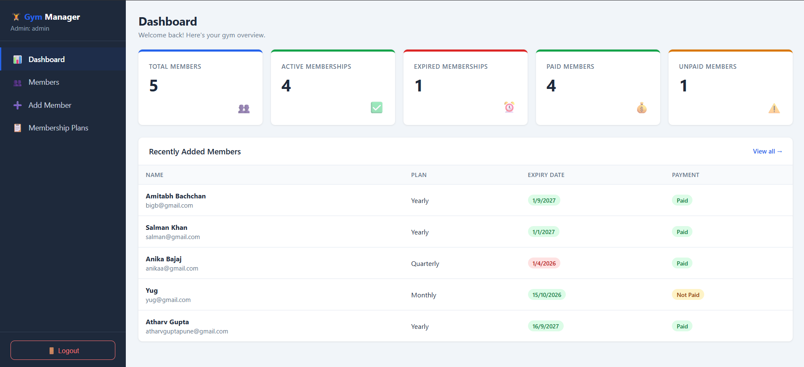
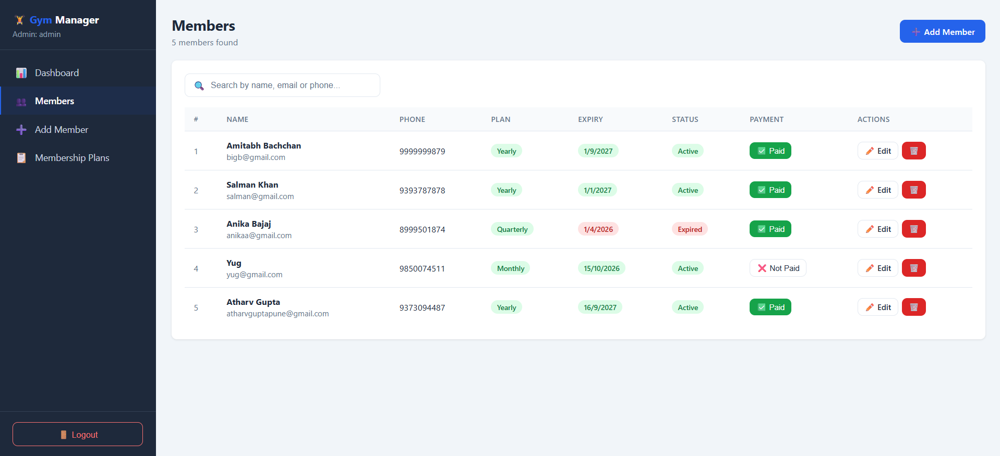
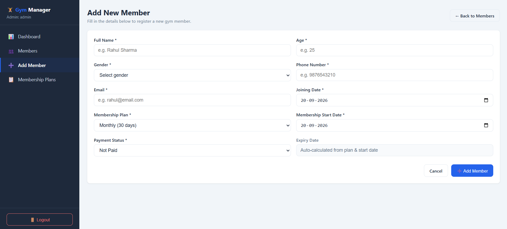
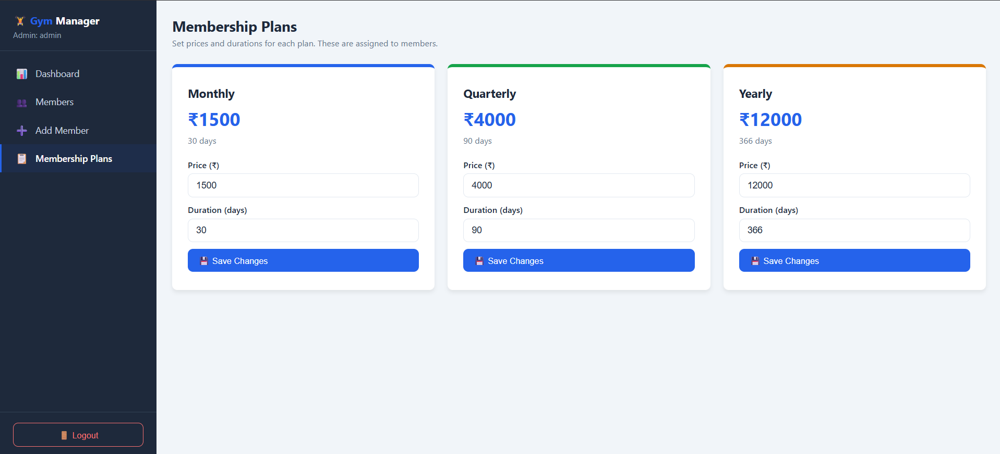

# Gym Membership Management System

A web-based Gym Membership Management System developed as a college project.

The system helps gym administrators manage members, memberships, payment status and membership plans through an easy-to-use dashboard.

## Features

- Admin Login
- Protected Dashboard
- Dashboard statistics
- Add new gym members
- Edit member details
- Delete members
- Search members by name, email or phone
- Monthly, Quarterly and Yearly membership plans
- Automatic membership expiry date calculation
- Paid / Not Paid payment status
- Active and Expired membership status
- MongoDB database integration

## Technologies Used

### Frontend

- React.js
- Vite
- JavaScript
- CSS

### Backend

- Node.js
- Express.js

### Database

- MongoDB Atlas
- Mongoose

## Project Structure

```text
Gym-Manage/
│
├── backend/
│   ├── config/
│   ├── middleware/
│   ├── models/
│   ├── routes/
│   ├── createAdmin.js
│   └── server.js
│
├── frontend/
│   ├── src/
│   ├── public/
│   └── package.json
│
├── screenshots/
│   ├── login.png
│   ├── dashboard.png
│   ├── members.png
│   ├── add-member.png
│   └── membership-plans.png
│
└── README.md

## Screenshots

### Admin Login


### Dashboard



### Members Management



### Add New Member



### Membership Plans



## Database

The application uses MongoDB Atlas as the database and Mongoose for database connectivity and schema management.

Member information such as name, age, gender, phone, email, membership plan, start date, expiry date and payment status is stored in the database.